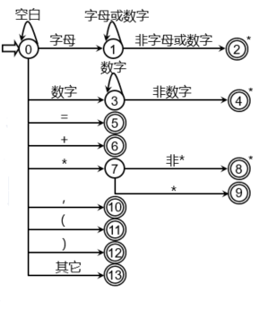

# Lab1总结

1. 要预设一个字符串数组来存放关键字

2. 通过fgetch从源文件中读取字符

3. 根据状态图写程序：

   如果是空格换行则跳过

   如果是字母或下划线则开始读取并存储这之后是字母、下划线、数字的字符，结束后判断是否是关键字，不是关键字就是标志符

   如果是数字则开始读取并存储之后的数字，得到一个整数

   如果是其他则判断是否是":=", ">=", "<="

   不是则是单个标点

